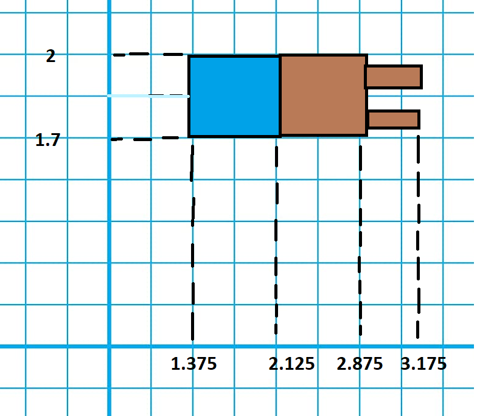

# Full Body Movement
**Under the supervision of: [Eng. Ayman Anwar](https://github.com/A-M-Anwar) and [Eng. Eslam Adel](https://github.com/EslamAdel)**

##### Imortant Notes:
**1. Please check some screenshots put at the [Results](#6-results) sections**
**2. Be aware of the keys responsible in [Key Actions and Movement](#5-key-actions-and-movement) for the movement of each part shown in the table at the end of the README.**

### 1. The Full Body
So this is our final body. We are going to divide it into three main parts; the legs, the arms, and the rest (trunk, chest, head). We are going to illustrate the implementation of each part and controlling some movements of these parts. 

<center></center>

### 2. Legs
Each leg consists of a hip, a calf, and a foot.
<center></center>
A. Hip:
The hip is a cube that is scaled for length 1 in each dimension into 0.5 in X and Z and stays 1 in Y direction. It is translated by - 0.5 in Y direction so that the top is at y = 0. And by 
0.5 in x so the origin of the right leg is located at x = 0.5. It rotates in Z around y = 0 and in X around x = 0.5. The rotation of the hip affects the rotation of the following leg parts to show them rotating as a single object.
```cpp
glTranslatef(0.5, 0.0, 0.0);
    glRotatef((GLfloat)legZ[0], 0.0, 0.0, 1.0);
    glTranslatef(-0.5, 0.0, 0.0);

    glRotatef((GLfloat)legX[0], 1.0, 0.0, 0.0);
    glTranslatef(0.5, -0.5, 0.0);

    glPushMatrix();
    glColor3f(1.0, 1.0, 1.0);
    glScalef (0.5, 1.0, 0.5);
    glutSolidCube (1.0);
    glPopMatrix();
```

B. Calf: The calf has the same dimensions and translations as the hip but transalted another -1 in Y direction. The calf has its own rotation in Z around y = -1
```cpp
    glTranslatef(0.0, -0.5, 0.0);
    glRotatef(GLfloat (knee[0]), 1.0, 0.0, 0.0);
    glTranslatef(0.0, -0.5, 0.0);
    glPushMatrix();
    glColor4f(0.71, 0.4, 0.12, 0.5);
    glScalef (0.5, 1.0, 0.5);
    glutSolidCube (1.0);
    glPopMatrix();
```

C. Foot: The foot is a cube scaled into 0.75 in X, 0.25 in Y, and 0.75 in Z.
```cpp
    glTranslatef(0.0, -0.625, 0.0);
    glPushMatrix();
    glColor3f(0.0, 0.0, 1.0);
    glScalef (0.75, 0.25, 0.75);
    glutSolidCube (1.0);
    glPopMatrix();
```

### 3. Arms
Each arm consists of a shoulder, and an arm, and a hand. A hand consists of 5 fingers with the metacarpals (end of fingers).
<center></center>
* The following is the side view of the hand.
<center></center>

A. Shoulder: the shoulder is a cube scaled 0.75, 0.3, 0.3 in X, Y, Z, and translated so that the end down left point is at (1.375, 1.7, 0.15). The shoulder rotates in Z around x = 1.375 and in X around y = 1.85. The rotations also affect the following arm parts to look as if they were rotating as an actual single arm.
```cpp
    glTranslatef(1.25, 1.85, 0.3);


    glRotatef((GLfloat)armZ[0], 1.0, 0.0, 0.0);


    glTranslatef(-0.375, 0, 0);
    glRotatef(arm[0], 0.0, 0.0, 1.0);
    glTranslatef(0.375, 0, 0);

    // Draw the limb
    // The shoulder is centered in origin and has 1, 1, 1 dimensions
    glPushMatrix();
    glColor3f(0.0, 0.0, 1.0);
    glScalef (0.75, 0.3, 0.3);
    glutSolidCube (1.0);
    glPopMatrix();
```

B. Forearm: the forearm is a cube has the same dimensions as the shoulder but translated another 0.75 in the X direction. It rotates around x = 2.125 in Z direction.

```cpp
    glTranslatef(0.75, 0, 0);
    glTranslatef(-0.375, 0, 0.0);
    glRotatef((GLfloat)elbow[0], 0.0, 0.0, 1.0);
    glTranslatef(0.375, 0, 0.0);
    glPushMatrix();
    glColor3f(0.71, 0.4, 0.12);
    glScalef (0.75, 0.3, 0.3);
    glutSolidCube (1.0);
    glPopMatrix();
```

C. Fingers: In each hand, there are 5 fingers. Here we will call the carbals (beginning and middle of the fingers) as the flanges and metacarbals (end of fingers) as just fingers. 4 of the are distributed and take equal spaces of the upper part of the hand and the lower finger (thumb) is located at the cneter shifted down a little bit in -Z direction.

```cpp

    // START OF FINGER 1
    glPushMatrix();

    glTranslatef(0.475, 0.05, 0.1125);
    glColor3f(1, 0, 0);

    glTranslatef(-0.1 , 0, 0);
    glRotatef(flang[0], 0, 0, 1);
    glTranslatef(0.1, 0, 0);
    glPushMatrix();
    glScalef(0.2, 0.1, 0.05);
    glutSolidCube(1.0);
    glPopMatrix();


    glPushMatrix();
    glTranslatef(0.1, 0, 0);
    glTranslatef(-0.05, 0, 0);
    glColor4f(0.71, 0.4, 0.12, 0.5);
    glRotatef(fingers[0], 0, 0, 1);
    glTranslatef(0.05, 0, 0);
    glScalef(0.1, 0.1, 0.05);
    glutSolidCube(1.0);
    glPopMatrix();

    glPopMatrix();

    // END OF FINGER 1


    // START OF FINGER 2
    glPushMatrix();

    glTranslatef(0.475, 0.05, 0.0375);
    glColor3f(1, 0, 0);

    glTranslatef(-0.1 , 0, 0);
    glRotatef(flang[0], 0, 0, 1);
    glTranslatef(0.1, 0, 0);
    glPushMatrix();
    glScalef(0.2, 0.1, 0.05);
    glutSolidCube(1.0);
    glPopMatrix();


    glPushMatrix();
    glTranslatef(0.1, 0, 0);
    glTranslatef(-0.05, 0, 0);
    glColor4f(0.71, 0.4, 0.12, 0.5);
    glRotatef(fingers[0], 0, 0, 1);
    glTranslatef(0.05, 0, 0);
    glScalef(0.1, 0.1, 0.05);
    glutSolidCube(1.0);
    glPopMatrix();

    glPopMatrix();

    // END OF FINGER 2

    // START OF FINGER 3
    glPushMatrix();

    glTranslatef(0.475, 0.05, -0.0375);
    glColor3f(1, 0, 0);

    glTranslatef(-0.1 , 0, 0);
    glRotatef(flang[0], 0, 0, 1);
    glTranslatef(0.1, 0, 0);
    glPushMatrix();
    glScalef(0.2, 0.1, 0.05);
    glutSolidCube(1.0);
    glPopMatrix();


    glPushMatrix();
    glTranslatef(0.1, 0, 0);
    glTranslatef(-0.05, 0, 0);
    glColor4f(0.71, 0.4, 0.12, 0.5);
    glRotatef(fingers[0], 0, 0, 1);
    glTranslatef(0.05, 0, 0);
    glScalef(0.1, 0.1, 0.05);
    glutSolidCube(1.0);
    glPopMatrix();

    glPopMatrix();

    // END OF FINGER 3


    // START OF FINGER 4
    glPushMatrix();

    glTranslatef(0.475, 0.05, -0.1125);
    glColor3f(1, 0, 0);

    glTranslatef(-0.1 , 0, 0);
    glRotatef(flang[0], 0, 0, 1);
    glTranslatef(0.1, 0, 0);
    glPushMatrix();
    glScalef(0.2, 0.1, 0.05);
    glutSolidCube(1.0);
    glPopMatrix();


    glPushMatrix();
    glTranslatef(0.1, 0, 0);
    glTranslatef(-0.05, 0, 0);
    glColor4f(0.71, 0.4, 0.12, 0.5);
    glRotatef(fingers[0], 0, 0, 1);
    glTranslatef(0.05, 0, 0);
    glScalef(0.1, 0.1, 0.05);
    glutSolidCube(1.0);
    glPopMatrix();

    glPopMatrix();

    // END OF FINGER 4


    // START OF FINGER 5
    glPushMatrix();

    glTranslatef(0.475, -0.1, 0);
    glColor3f(1, 0, 0);

    glTranslatef(-0.1 , 0, 0);
    glRotatef(- flang[0], 0, 0, 1);
    glTranslatef(0.1, 0, 0);
    glPushMatrix();
    glScalef(0.2, 0.1, 0.05);
    glutSolidCube(1.0);
    glPopMatrix();


    glPushMatrix();
    glTranslatef(0.1, 0, 0);
    glTranslatef(-0.05, 0, 0);
    glColor4f(0.71, 0.4, 0.12, 0.5);
    glRotatef(-fingers[0], 0, 0, 1);
    glTranslatef(0.05, 0, 0);
    glScalef(0.1, 0.1, 0.05);
    glutSolidCube(1.0);
    glPopMatrix();

    glPopMatrix();

    // END OF FINGER 5
```

### 4. Rest of Body

<center></center>

##### A. Trunk:
Trunk is a cube scaled by 1.5, 0.5, 0.5 in X, Y, Z. It is located at the origin translate by 0.25 in Y direction.

```cpp
// START OF TRUNK
    glPushMatrix();
    glTranslatef(0.0, 0.25, 0.0);
    glScalef(1.5, 0.5, 0.5);
    glColor3f(1.0, 1.0, 1.0);
    glutSolidCube(1.0);
    glPopMatrix();
// END OF TRUNK
```


##### B. Chest
Chest is a cube scaled by 1.5, 1.5, 0.5 in X, Y, Z. translated by 0.75 in addition to the 0.25 from the trunk transition. 

```cpp
// START OF STOMACH
    glPushMatrix();
    glTranslatef(0.0, 1.25, 0.0);
    glScalef(1.5, 1.5, 0.5);
    glColor3f(1.0, 0.0, 0.0);
    glutSolidCube(1.0);
    glPopMatrix();
// END OF STOMACH
```

##### C. Head
Head is a sphere with radius 0.35 and shifted by 2.5 in Y direction.
```cpp
// START OF HEAD
    glPushMatrix();
    glTranslatef(0.0, 2.5, 0.0);
    glColor3f(0.71, 0.4, 0.12);
    glutSolidSphere(0.35, 16, 16);
    glPopMatrix();
// END OF HEAD
```

### 5. Key Actions and Movement
The following table illustrates the movements for each part of the body and the keyboard keys that control them.

<center></center>

1. Left part of body

| Key |             Action             |
|:---:|:------------------------------:|
|  x  | Left leg rotation around X CCW |
|  X  |  Left leg rotation around X CW |
|  z  | Left leg rotation around Z CCW |
|  Z  |  Left leg rotation around Z CW |
|  s  |     Left knee movement CCW     |
|  S  |      Left knee movement CW     |
|  c  | Left arm movement around Z CCW |
|  C  |  Left arm movement around Z CW |
|  v  |     Left elbow movement CCW    |
|  V  |     Left elbow movement CW     |
|  q  |      Left flanges flexion      |
|  Q  |     Left flanges extension     |
|  w  |      Left fingers flexion      |
|  W  |     Left fingers extension     |


2. Right part of body


| Key |             Action             |
|:---:|:------------------------------:|
|  n  | Right leg rotation around X CCW |
|  N  |  Right leg rotation around X CW |
|  m  | Right leg rotation around Z CCW |
|  M  |  Right leg rotation around Z CW |
|  k  |     Right knee movement CCW     |
|  K  |      Right knee movement CW     |
|  j  | Right arm movement around Z CCW |
|  J  |  Right arm movement around Z CW |
|  b  |     Right elbow movement CCW    |
|  B  |     Right elbow movement CW     |
|  I  |      Right flanges flexion      |
|  i  |     Right flanges extension     |
|  O  |      Right fingers flexion      |
|  o  |     Right fingers extension     |


### 6. Results
Here are some result of our body.
<p float="left">
 


</p>

### 7. Objects
Wavefront Object Models are loaded using the glm library, The DrawModel Function Takes a GLMmodel and it's scale to draw the object, the DrawModel Function is given bellow

```cpp
void DrawModel(GLMmodel* Object, GLfloat Scale)
{

    if (!Object) exit(0);
    glmUnitize(Object);
    glmFacetNormals(Object);
    glmVertexNormals(Object, 90.0);
    glmScale(Object, Scale);
    glmDraw(Object, GLM_SMOOTH|GLM_TEXTURE|GLM_MATERIAL);
}
```
